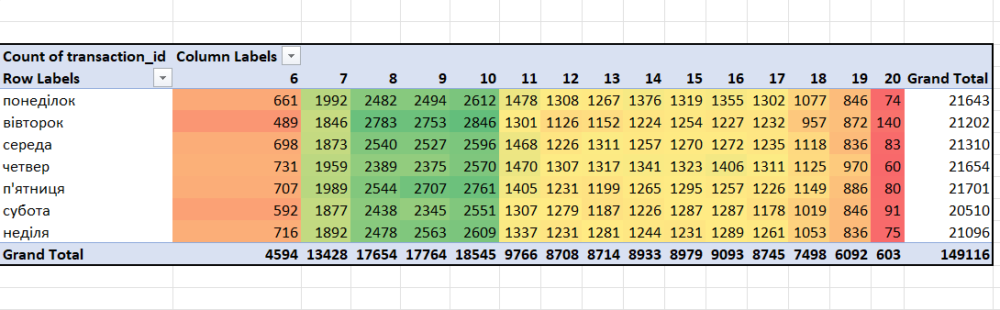
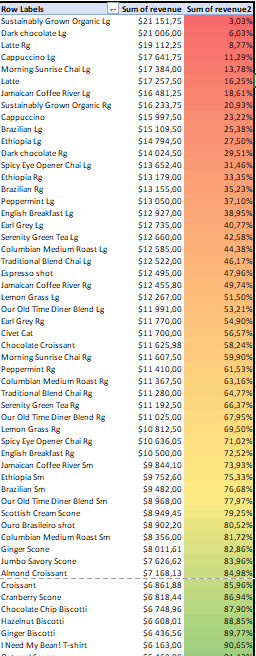
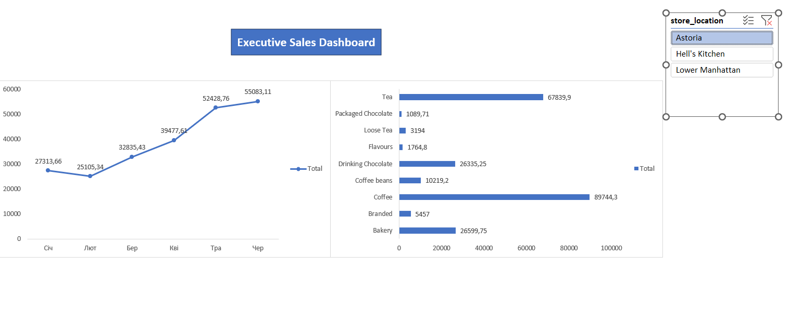

# Coffee Shop Sales & Operations Analysis

## Project Overview
This project transforms raw transactional data from a retail coffee chain into actionable business insights. Using Microsoft Excel, I analyzed over 100,000 rows of sales data to optimize staff scheduling, identify top-performing product categories, and calculate core retail metrics for a prospective loyalty program.

## Business Problems & Solutions

### 1. When should we schedule more baristas?
* Extracted the hour and weekday from raw timestamps and built a conditional formatting matrix to visualize peak foot traffic.
* **Insight:** The morning rush is heavily concentrated between 08:00 and 10:00 AM daily. Volume drops significantly after 11:00 AM.
* **Recommendation:** Optimize payroll by scheduling overlapping barista shifts from 7:30 AM to 11:30 AM, then reducing headcount for the afternoon.

### 2. Which products are our "Cash Cows"?
* Applied the Pareto Principle (80/20 rule) using a cumulative running total calculation across all product lines.
* **Insight:** Out of 80 unique menu items, it takes 51 items to generate 80% of total revenue.
* **Recommendation:** Because revenue is spread across a wide catalog rather than concentrated in a few items, the business must maintain a broad inventory strategy. However, strict supply chain priority should still be given to the top 10 items. Additionally, the bottom 15-20 items should be reviewed for potential delisting to optimize warehouse space and reduce holding costs.

### 3. Basket Analysis (ATV & IPT)
* Grouped individual line items into distinct customer receipts to calculate the average order value and items per transaction.
* **Insight:** * **Average Transaction Value (ATV):** $4.69
  * **Items Per Ticket (IPT):** 1.4
* **Recommendation:** Since most customers purchase a single drink and no food (IPT 1.4), introduce a cross-selling initiative at the register to drive IPT closer to 2.0.

## Interactive Dashboard
I built a dynamic dashboard using PivotTables and Slicers to allow store managers to filter revenue trends by location.

## Technical Skills Demonstrated
* **Data Blending:** `XLOOKUP`
* **Aggregation & Modeling:** Pivot Tables, Calculated Columns, Time Series Grouping
* **Data Visualization:** PivotCharts, Slicers, Conditional Formatting
